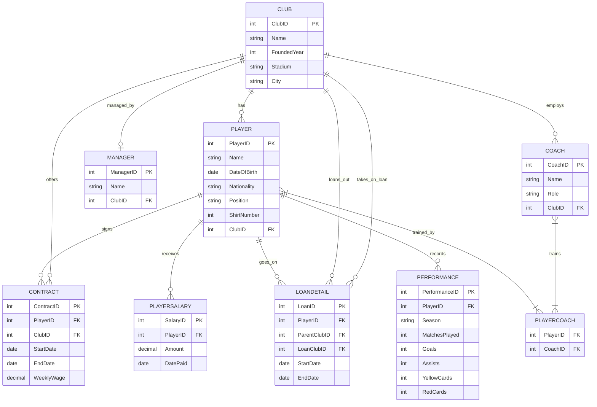

# Football Club Management System

## System Design & Architecture

### 1. Entities & Relationships
- **Club**: The core entity. A club has one manager, multiple coaches, and multiple players.
- **Player**: Plays for a club. A player can be loaned out to another club.
- **Contract**: A player has a contract with a club detailing their wage and duration.
- **PlayerSalary**: Tracks historical salary payments for players.
- **LoanDetail**: Tracks players who are loaned from a parent club to a loan club.
- **Coach**: Works for a club and trains players.
- **PlayerCoach**: Many-to-many relationship mapping players to specific coaches.
- **Manager**: Manages a club.
- **Performance**: Tracks player statistics per season.

### 2. ER Diagram

## Running the Project

### Prerequisites
1. MySQL Workbench locally installed.
2. Node.js locally installed.

### Step 1: Database Setup
1. Open MySQL Workbench.
2. Run the SQL scripts found in the `database/` folder in the following order:
   - `schema.sql`: Creates the database and tables.
   - `data.sql`: Inserts sample data.
   - `queries.sql`: Contains useful views and queries.

### Step 2: Backend Setup
1. Open a terminal and navigate to the `backend` folder: `cd backend`
2. Install dependencies: `npm install`
3. Configure `db.js` if your MySQL root password is not `password`.
4. Start the server: `npm start` (Runs on port 3000)

### Step 3: Frontend Setup
1. Simply open HTML files in the `frontend` folder using your browser, or use a tool like Live Server.
2. Start with `frontend/index.html`.
